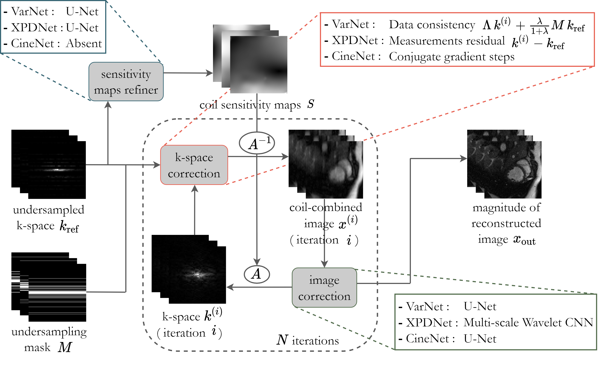

# Deep learning-based models for multi-coil cine cardiac MRI reconstruction
## Description

This project presents novel methods to tackle the problem of dynamic MRI
reconstruction (2D space + 1D time) of accelerated multi-coil cardiac data.

The proposed methods are inspired by the recent deep-learning models
- End-to-End Variational Net [[1]](#VarNet)
- XPDNet [[2]](#XPDNet)

that achieved state-of-the-art results in the [2020 FastMRI challenge](https://fastmri.org/leaderboards/challenge/)
for static MRI reconstruction of the brain and the knee, and by
- CineNet [[3]](#CineNet)

for dynamic reconstruction of 2+1D cardiac data.

The underlying architecture for all proposed models is based on the cross-domain
network with unrolled optimisation. A high-level diagram of the architecture is
shown below:



The dynamic aspect of the MRI data is taken into account by adjusting the models
to process 2+1D data volumes and exploit the inherent temporal redundancies of
cine cardiac data. To this aim, each model was structured including five dynamic
variants:
- **2D** - static scenario, each temporal slice is processed independently
- **3D** - each 2+1D volume is processed as a whole; model is isotropic towards
each dimension
- **XT** - two copies of each volume are rotated in the two 2D spatio-temporal
domains (*x-t* plane and *y-t* plane), respectively, then processed by separate
image correction networks and finally recombined
- **XF** - same as for 'XT', but volume firstly undergoes an FFT along the temporal
dimension to sparsify the domain
- **CRNN** - leverage the time-dependency directly by implementing a recurrence
along the temporal direction and also across the unrolled iterations. This variant
is based on the Convolutional Recurrent Neural Network introduced by [[4]](#CRNN)

## Getting Started
- Clone the repository:
```
git clone https://github.com/f78bono/deep-cine-cardiac-mri.git
```
- Create a new virtual environment and install the requirements in `./requirements.txt`
- Set up a BART environment following the instruction in this [notebook](./notebooks/BART_setup.ipynb)
- Change the paths in the following files according to your root directory:
```
1) traintest_scripts/dirs_path.yaml
data_path: /path/to/data
log_path: /root/traintest_scripts
save_path: /root/results
2) reconstruction/pl_modules/mri_module
path_config = pathlib.Path("/root/traintest_scripts/dirs_path.yaml")
3) traintest_scripts/model/train_test_model.py
path_config = pathlib.Path("/root/traintest_scripts/dirs_path.yaml")
```

## Data Format
The data set used in this project consists of breath-hold, retrospectively
cardiac-gated, Cartesian, bSSFP multi-coil cine cardiac raw data. Each MRI volume
is stored in a HDF5 file that contains the raw k-space data, with dimensions
(number of slices, height, width, number of coils).

The path to the data directory expects subdirectories `train/valid/test`. If a
subdirectory `inference` is also included, the program can be given the option
to store the model outputs for visualisation purposes. The code for dealing with
the raw HDF5 files can be found in `./reconstruction/data/mri_data.py`. Adjust the
following settings according to the specifics of the data set used:
```
scaling = 1e6
crop_shape = (200, 200)
crop_target = (180, 180)
n_slices = 15
filter_size = [0.7, 0., 0.3, 0.3]
```

## Basic usage
The scripts for training and testing each model can be found in the `traintest_scripts` 
subfolders. Running a script with no arguments, for example
```
python3 train_test_varnet.py
``` 
will start the training of the model (in this case XF-VarNet) with default parameters.
Pass optional arguments to overwrite the default parameters, for example
```
python3 train_test_varnet.py \
    --epochs 50 \
    --save_checkpoint 1 \
    --num_cascades 6 \
    --dynamic_type CRNN
```
For testing use the command
```
python3 train_test_varnet.py --mode test --load_model 1
```
plus the arguments needed for the model under consideration.

A detailed description of each argument can be found in the source code.

## Evaluation
A qualitative assessment of the models was perfomed by visualing the reconstructed
output along with the absolute error between normalised target and output. Check this
[notebook](./notebooks/reconstruction_visualisation.ipynb) for a visual comparison of
the different model outputs.

The quantitative metrics used for evaluation are:
- Structural similarity index measure (**SSIM**)
- Normalised mean square error (**NMSE**)
- Peak signal-to-noise ratio (**PSNR**)

These statistics are compiled automatically during testing and stored in the `results`
folder.

## Citations
### VarNet
[code](https://github.com/facebookresearch/fastMRI) [publication](https://link.springer.com/chapter/10.1007/978-3-030-59713-9_7)

[1] Sriram, Anuroop et al. (2020). **"End-to-End Variational Networks for Accelerated MRI Reconstruction"**. In: *Medical Image Computing and Computer Assisted Intervention - MICCAI 2020*. Cham: Springer International Publishing, pp. 64 - 73.

### XPDNet
[code](https://github.com/zaccharieramzi/fastmri-reproducible-benchmark) [arXiv](https://arxiv.org/abs/2010.07290)

[2] Ramzi, Zaccharie et al. (2021). **"XPDNet for MRI Reconstruction: an application to the 2020 fastMRI challenge"**. In: *arXiv: 2010.07290*.

### CineNet
[code](https://github.com/koflera/DynamicRadCineMRI) [publication](https://aapm.onlinelibrary.wiley.com/doi/10.1002/mp.14809)

[3] Kofler, Andreas et al. (2021). **"An end-to-end-trainable iterative network architecture for accelerated radial multi-coil 2D cine MR image reconstruction"**. In: *Medical Physics* 48.5, pp. 2412 - 2425.

### CRNN
[publication](https://ieeexplore.ieee.org/document/8425639/)

[4] Qin, Chen et al. (2019). **"Convolutional Recurrent Neural Networks for Dynamic MR Image Reconstruction"**. In: *IEEE Transactions on Medical Imaging* 38.1, pp. 280 - 290.
